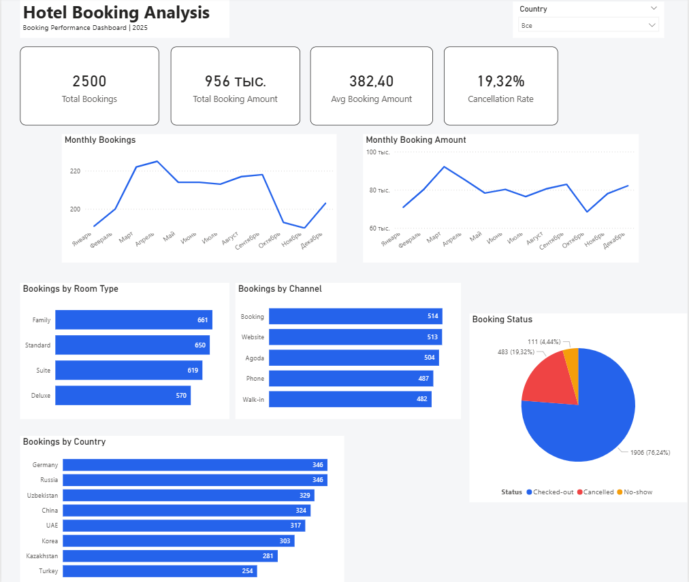

# Hotel Booking Analysis

## Project Overview

This project analyzes hotel booking data for 2025 using SQL, Power BI, and Python.

The analysis focuses on booking trends, room types, booking channels, cancellations, booking amounts, and customer booking behavior.

The goal of the project is to identify key patterns in hotel bookings and provide useful business insights.

## Tools Used

- PostgreSQL — data exploration and SQL analysis
- Power BI — dashboard creation and data visualization
- Python — data analysis and visualization
- Pandas — data manipulation and analysis
- Matplotlib — Python visualizations
- Excel — source dataset and initial data review

## Dataset

The dataset contains 2,500 hotel booking records for 2025.

Main fields include:

- Booking ID
- Booking Date
- Check-in Date
- Check-out Date
- Country
- Room Type
- Booking Channel
- Booking Status
- Price Per Night
- Number of Nights
- Total Booking Amount

## Data Quality Checks

Before analysis, the dataset was checked for:

- Missing values
- Duplicate records
- Unique booking IDs
- Category consistency
- Booking amount consistency
- Invalid booking lead times

The `TotalAmount` field was validated against:

`PricePerNight × Nights`

No mismatches or negative lead times were found.

## Analysis

The project includes analysis of:

- Monthly booking trends
- Monthly booking amounts
- Booking status distribution
- Room type performance
- Booking channel performance
- Country-level booking activity
- Cancellation rates
- Cancellation rates by booking channel
- Booking lead time
- Monthly booking amount by room type

## Key Insights

### Monthly Booking Activity

Booking activity varied throughout the year. April recorded the highest number of bookings, while November had the lowest.

### March Had the Highest Booking Amount

March recorded the highest total booking amount, although April had the highest number of bookings.

Further analysis showed that Suite bookings generated approximately 43K in March — the highest monthly booking amount for this room type during the year. This contributed significantly to March's overall booking amount.

### Room Type Performance

Family was the most frequently booked room type with 661 bookings, followed by Standard with 650 bookings. Deluxe had the lowest number of bookings with 570.

Suite generated the highest total booking amount among all room types throughout the year.

### Booking Channels

Booking and Website were the leading booking channels with 514 and 513 bookings respectively.

However, booking volume was relatively evenly distributed across all five channels, suggesting that the hotel was not heavily dependent on a single booking channel.

### Cancellation Analysis

483 out of 2,500 bookings were cancelled, resulting in a cancellation rate of 19.32%.

This means approximately 1 in 5 bookings was cancelled.

Cancellation rates were relatively similar across booking channels, so no single channel appeared to be the main driver of cancellations.

### Booking Status

- Checked-out: 76.24%
- Cancelled: 19.32%
- No-show: 4.44%

## Project Structure

```text
Hotel_Booking_Project/
│
├── Dataset/
│   └── Hotel_Booking_Analysis_Dataset.xlsx
│
├── Python/
│   └── hotel_booking_analysis.ipynb
│
├── Power BI/
│   └── Hotel_Booking_Analysis.pbix
│
├── queries/
│   ├── 01_create_table.sql
│   ├── 02_check_import.sql
│   ├── 03_create_booking_channels.sql
│   ├── 04_create_join_test.sql
│   ├── basic_queries.sql
│   ├── case.sql
│   ├── cte.sql
│   ├── date_functions.sql
│   ├── group_by_having.sql
│   ├── join_analysis.sql
│   └── window_functions.sql
│
├── screenshots/
│   └── hotel_booking_dashboard.png
│
└── README.md
```
## Dashboard


